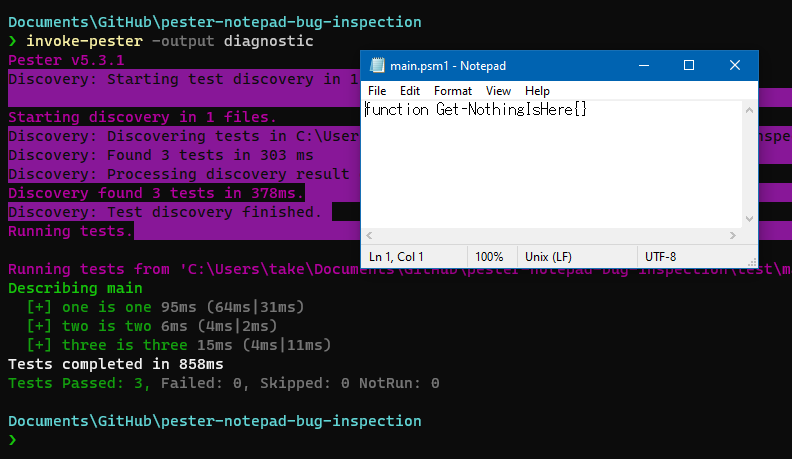

# Peser Notepad Open in Diagnostic run

## ReProduction

When run `Invoke-Pester -Output Diagnostic`,
open main.psm1 with notepad.exe on line 4 on [main.Tests.ps1](test/main.Tests.ps1).

Same quantity of `It` functions and `notepad` windows.



## Environment

Pester 5.3.1

```powershell
$Psversiontable
```

```out
Name                           Value
----                           -----
PSVersion                      7.2.2
PSEdition                      Core
GitCommitId                    7.2.2
OS                             Microsoft Windows 10.0.19044
Platform                       Win32NT
PSCompatibleVersions           {1.0, 2.0, 3.0, 4.0…}
PSRemotingProtocolVersion      2.3
SerializationVersion           1.1.0.1
WSManStackVersion              3.0
```
